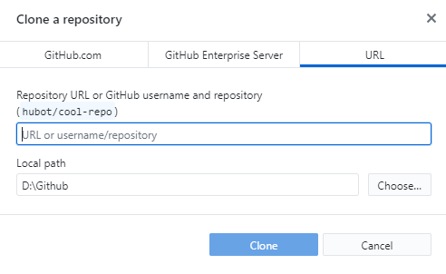
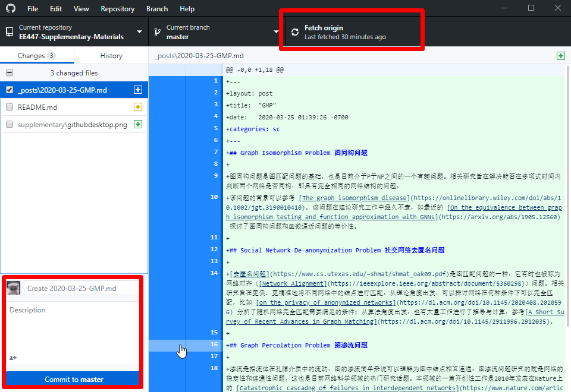

# Welcome to Collaborative Website of Mobile Internet Course - EE447

项目的所有人可以通过使用[Github在线编辑器](https://github.com/davendw49/EE447-Supplementary-Materials/edit/master/README.md) 对这个说明文档进行相关的修改。

每次有效的提交, GitHub Pages将执行[Jekyll](https://jekyllrb.com/)对网页的内容进行编译转义，成为有效的显示内容。

## 助教提交规范

助教可以根据随时进行文件的修改和提交，但是如果你选择在分支(branch)进行提交，则需要发起merge request由所有者进行合并。

### IF 使用 Github Desktop

 - 在Desktop中进行仓库的克隆，输入[EE447-Supplementary-Materials](https://github.com/davendw49/EE447-Supplementary-Materials)的`git`地址(只有第一次使用的时候需要这一步)
    
 - 在对应的文件夹下进行文件操作，即将添加的文件以`markdown`的形式方法到`_posts\`文件目录下，相关格式说明可参照`_posts\`现有的文件，*记住命名是按照YY-MM-DD-FILENAME*空格以`-`代替
 - 由于各位助教是负责不同的模块，所以冲突的可能性不是很大，如有冲突联系[daven].(mailto:davendw@sjtu.edu.cn)
 - 提交的时候需要注意，最好还是执行`pull`以免发生不必要的冲突事件，提交需注意修改Desktop的`comment`.
    
 - 并在最后点击右上角的`push` 

### IF 使用 GIT BASH
    打开命令行，开始操作以下代码，第一个命令只有第一次的时候需要使用
 - `git clone https://github.com/davendw49/EE447-Supplementary-Materials.git`
 - 可能需要输入用户名和密码
 - `cd EE447-Supplementary-Materials`
 - 接下来在对应的文件夹下进行文件操作，即将添加的文件以`markdown`的形式方法到`_posts\`文件目录下，相关格式说明可参照`_posts\`现有的文件，*记住命名是按照YY-MM-DD-FILENAME*空格以`-`代替
 - `git pull`
 - `git add _posts\YY-MM-DD-FILENAME`
 - `git commit -m "说明一下修改内容"`
 - `git push`
    如有冲突联系[daven](mailto:davendw@sjtu.edu.cn).

## 课程同学提交规范

在研究和学习的过程当中，你们一定也看到了不少的有趣的项目和文章，我们欢迎你们分享提交资源，结合社区贡献的开源计划，你们可以通过**issues**和**pull request**的方式进行参与到我们的共享资源中来。
 - 首先你需要`fork`我们的网站源代码，进行修改，接下来的步骤详细请见如下的链接
 - [如何使用github中的pull request功能？](https://blog.csdn.net/wangzi11111111/article/details/79861056)
 - 如有问题请联系[daven](mailto:davendw@sjtu.edu.cn)

## 闲话

如果对简易构建静态网页感兴趣可以更多参照[文档](https://help.github.com/categories/github-pages-basics/) 我们一起协作维护移动互联网课程的课程网站。

## YOUNG KING
`daven:` 
- ***[davendw49]([davendw49@github.com](https://github.com/davendw49))***
- ***[daven-email](davendw@sjtu.edu.cn)***